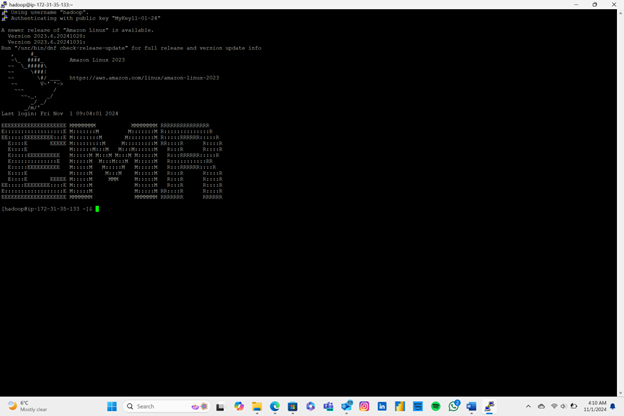

# ☁️ AWS EMR Cluster Setup

## 📌 Overview  
This project documents the setup and configuration of an Amazon EMR cluster with Hadoop, Spark, Hive, and HBase — including SSH access via PuTTY and IAM/security group configurations.

---

## 🧠 Key Highlights
- Created EC2 key pair and configured SSH access  
- Launched EMR cluster using `m4.large` instances  
- Installed Hadoop ecosystem tools via AWS Console  
- Configured inbound rules and IAM roles  
- Connected via PuTTY using `.ppk` key for secure access

---

## 📁 Files
- [`aws-emr-cluster-setup.pdf`](https://github.com/prakshalishah/aws-emr-cluster-setup/blob/main/aws-emr-cluster-setup.pdf) – Final project PDF

---

## 🖼️ Preview  

